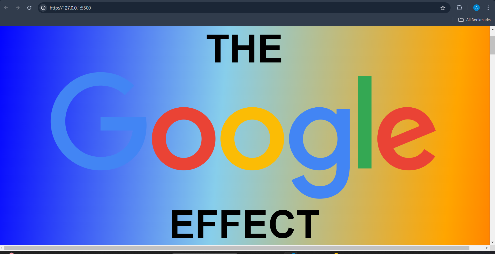

 (website screenshot)

This a simple scrolling website throughout documenting and exploring the concept of ‘the Google effect’. The website has an audio element of accompanying background music that can be controlled at the very top left on the web page. Other interactive elements of the page include the clickable animated google search bar. I have also included a link on my website to an article that delves deeper into a specific topic/concept concerning the google effect. As well as clickable links on the page that provide hypertextuality to my website's theme.

As the main theme and concept explored on my website is the Google effect I decided to make creative decisions that align with Google’s theme. I aimed to replicate Google’s aesthetic through hypertextuality within the layout and styling of my page. I designed some of my website to imitate the Google search results page. This included making subtitles blue (like the google search results). For more hypertext references I made one of the subtitles purple, to imitate what Google’s search results look like if you’ve already visited the link. I also put a mouse pointer hand (similar to Google’s one) over the purple subtitle. The beginning of the page includes the current official Google logo. I used this for emphasis on my site’s topic, rather than typing ‘Google’ in regular text. The background of the site is also a colourful gradient, which creates an illusion of movement while mimicking the colourful scheme of the Google logo. Furthermore, I felt that my choice of background music aligned with the visual and aesthetic elements of my website while creating somewhat of an immersive scrolling experience.

With an extension of time and resources there are many things I could envision adding to my website. Firstly, I would use JavaScript to add more interactivity to the site. This would include sound effects triggered by clickable images or text as well as an interactive game/quiz pertaining to ‘the Google effect’ for a more immersive experience. With more time and resources I would also add a parallax layered scrolling effect to include more movement in the scrolling process, while creating an illusion of the page being 3D. Perhaps with more time I could include more information on my chosen topic within additional pages of the website. 

